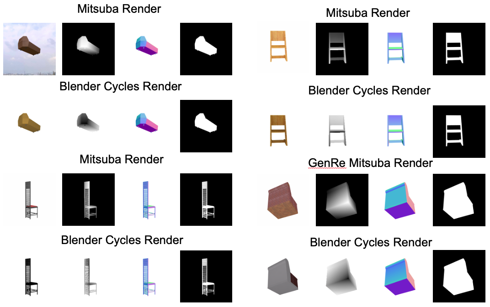

# Render Training Data Using Blender to Replicate Mitsuba Renders

Notes about example image
1. Blender processes shapenet geometry from `.obj` and `.mtl` files differently resulting in the differences in the bottom row. There might be a way to address this in Blender but for now it remains unresolved.
2. Relative depth images are 1 to 0 for Mitsuba and 0 to 1 for Blender. This can easily be fixed.
3. In the GenRe experiments absolute depth is necessary for backprojecting a depth image which is obtained by storing min-max values on the object surface and converting the relative depth image to an absolute depth image. The Blender ShapeNet rendering implementation outputs OpenEXR which can be converted to get these min-max values to match what's required by the GenRe codebase.

## Code

The code to replicate the GenRe training input images using a Blender is available [here](link-to-code)
