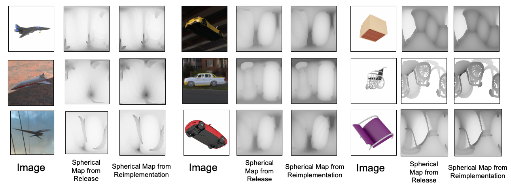

# Replicate Full Object Spherical Maps 

These spherical projection images were regenerated using the object pose information released by the GenRe authors to replicate the object pose before running the projection. The comparison above is between data released by the authors and data generated using our code.

Notes regarding spherical inpainting

1. Our implementation reuses a lot of functions that were released originally.
2. Spherical projections are done using meshes derived from voxel grids, with the origin being the original shapenet origin and are scaled down to fit inside a unit cube. 
3. The GenRe release does not require partial spherical maps.

## Code

The code to generate Spherical Maps using is available [here](link-to-code). The original data can be replicated by running this code on the replicated renders which can be obtained as [described here](rendering.md).
