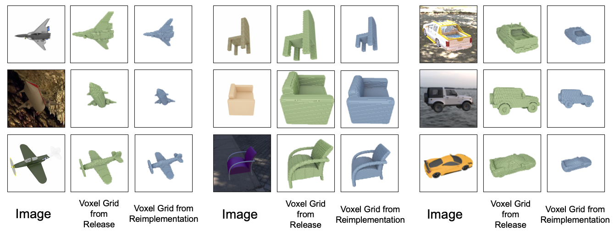

# Replicate Voxel Grids

These voxel grids were generated using the object pose information released by the GenRe authors to replicate the object pose before running resampling the canonical voxel grids. The comparison above is between data released by the authors and data generated using our code.

Notes regarding voxel grids

1.  GenRe is trained on truncated unsinged distance fields, which we generate from signed distance field grids which we extract from each mesh in ShapeNet.
2. The rotated voxel grids are generated by rotating the canonical voxel grid and resampling. 
3. Since rotation is done about the ShapeNet mesh origin, in this implementation the mesh is scaled down so that it doesnt go outside of the resampling volume when rotated.

## Code

The code to generate truncated unsinged distance voxel grids using is available [here](../generate_gt/).
